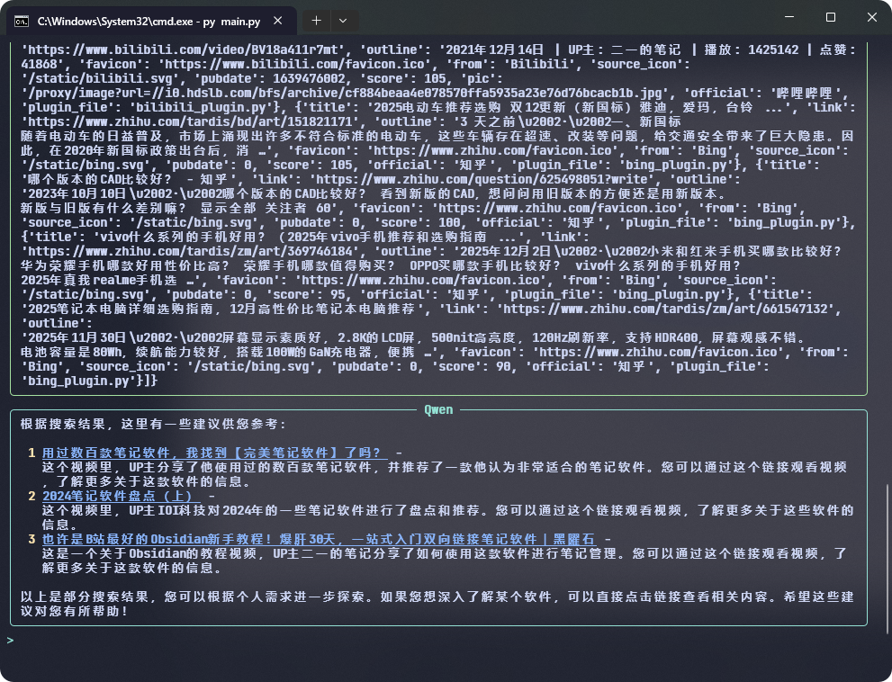

<div align="center">
  <h1>SodaSearch</h1>
  <h3>聚合多平台搜索的轻量级搜索平台</h3>
  
  <p>
    <a href="#主要特性">✨ 特性</a> •
    <a href="#安装与运行">🚀 快速开始</a> •
    <a href="#插件系统">🔌 插件</a> •
  </p>
</div>

> 💡 项目正在积极开发中，欢迎提交 Issue 和 PR！

## 主要特性

- 🚀 **统一搜索入口**：在一个界面中同时搜索多个平台的内容
- 🔌 **插件化架构**：易于扩展，支持自定义搜索源
- 🎨 **现代化 UI**：响应式设计，适配各种设备
- ⚙️ **可配置性**：可以启用/禁用不同的搜索插件
- 📊 **智能排序**：基于相关性和评分对结果进行排序
- 🖼️ **图片代理**：安全地加载第三方图片资源
- ✅ **官方标识**：识别并标记官方网站结果

## 运行截图


## API功能使用案例



> 将搜索API接入大语言模型（LangChain）

## 安装与运行

### 环境要求

- Python 3.7+
- pip 包管理器

### 安装依赖

```bash
pip install -r requirements.txt
```

### 运行应用

```bash
python main.py
```

默认情况下，应用将在 `http://127.0.0.1:5000` 上运行。

## 项目结构

```
SodaSearch/
├── main.py                 # 主应用程序文件
├── plugins/                # 插件目录
│   └── github_plugin.py    # GitHub搜索插件
├── plugins_config.json     # 插件配置文件
├── templates/              # HTML模板目录
├── static/                 # 静态资源目录
├── official.json           # 官方网站标识数据
└── README.md               # 项目说明文档
```

## 插件系统

SodaSearch 使用插件系统来集成不同的搜索服务。每个插件都是一个独立的 Python 文件，放置在 `plugins` 目录下。

### 插件规范

每个插件必须包含一个 `get_results` 函数，该函数接收一个查询字符串参数，并返回一个包含搜索结果的列表。

#### 结果格式

每个搜索结果必须是一个字典，包含以下字段：

| 字段名      | 类型   | 描述                        | 是否必填 |
| ----------- | ------ | --------------------------- | -------- |
| title       | 字符串 | 搜索结果标题                | 是       |
| link        | 字符串 | 搜索结果链接                | 是       |
| outline     | 字符串 | 搜索结果描述                | 是       |
| favicon     | 字符串 | 网站图标 URL                | 是       |
| from        | 字符串 | 搜索来源名称                | 是       |
| source_icon | 字符串 | 来源图标 URL（可选）        | 否       |
| score       | 数值   | 自定义评分（可选，默认 70） | 否       |

#### 示例插件

```python
import requests

def get_results(query):
    """
    示例插件
    返回自定义搜索结果
    """
    results = []
    try:
        # 调用API获取搜索结果
        # 处理结果
        results.append({
            'title': '示例结果',
            'link': 'https://example.com',
            'outline': '这是一个示例搜索结果',
            'favicon': 'https://example.com/favicon.ico',
            'from': '示例来源',
            'source_icon': 'https://example.com/source-icon.svg',
            'score': 85  # 自定义评分
        })
    except Exception as e:
        print(f"插件错误: {e}")

    return results
```

### 创建新插件

1. 在 `plugins` 目录下创建一个新的 Python 文件
2. 实现 `get_results` 函数
3. 确保函数返回符合要求的结果格式
4. 重启 SodaSearch 应用或使用调试模式自动重载

### 评分机制

- 插件可以返回自定义评分，影响搜索结果的排序
- 评分越高，结果排名越靠前
- 如果不提供评分，默认使用 70 分

## 配置

插件可以通过编辑 `plugins_config.json` 文件来启用或禁用：

```json
{
  "github_plugin": true
}
```

也可以通过 Web 界面的插件设置功能进行配置。

## 许可证

本项目采用 MIT 许可证 - 查看 [LICENSE](LICENSE) 文件了解详情。

## 免责声明

本项目仅供学习交流使用，请遵守各搜索平台的使用条款和法律法规。
